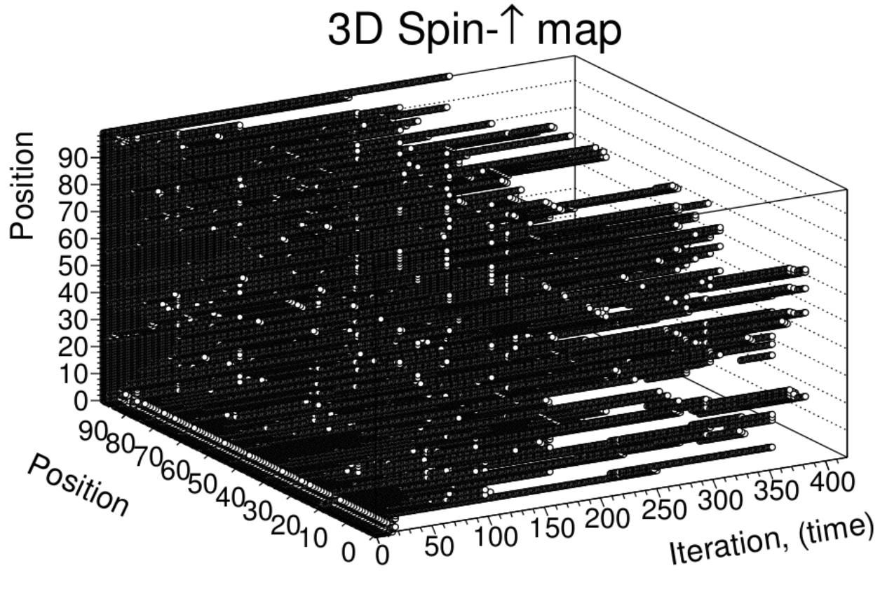

PDF : [Phase Transition in Ferromagnetic Simulation and Experiment](ising.pdf "ising PDF")

Abstract

 A program is written that implements a 3-dimensional Ising model and the Metropolis algorithm to simulate the phase transition of a ferromagnet to a paramagnet. Vanishing magnetization and a discontinuity in the average energy for simulated data is observed at the Curie temperature. Simulated data compared to experimental measurements of CoNiFeCB magnetization as a function of temperature shows that the simulation approaches the Curie temperature quicker. The Curie temperature for CoNiFeCB is measured to be approximately 600&nbsp;&deg;C .    

Introduction

Ferromagnetic materials posses a spontaneous magnetic moment which arises from the
regular arrangement of their electron spins. In a ferromagnet the unpaired electrons arrange
their alignments parallel to one another within domains separated by so-called Bloch walls.
The most well known ferromagnetic materials are iron, nickel and cobalt. Upon application
of a magnetic field to a ferromagnetic sample, the domains will align and the material
is said to be magnetized. Curiously, if a ferromagnetic sample is heated above a certain
critical temperature, the sample’s magnetization disappears; this temperature is the Curie
temperature. The phase transition that takes place at the Curie temperature is from spin
aligned ferromagnetism to disordered paramagnetism. [1][2]  
An interesting application for ferromagnetic materials may be found in electronics such
as in ferroelectric random access memory for computers (FeRAM). [3] From these points of
interest, we aim to understand and model the phase transition at the Curie temperature that
characterize ferromagnetic samples. In this study we simulate the thermodynamic effects on
spin in a ferromagnet and compare the simulation to data collected from a CoNiFeCB sample
consisting of measurements of magnetization as a function of temperature.  

 
 
Figure 1: A 3D lattice of 100 spins initially aligned spin-up. Spin up states are denoted with
circles and down states are shown as blank areas. Domains begin to form as the system
equilibrates. [2]    

Description of simulation and algorithm  
Ising model

The mathematical model of ferromagnetism we use is the Ising model which takes a Z
dimensional lattice and statically represents an atomic spin at each vertex. We will use a
3-dimensional model. Since the particles are fixed at each vertex, we need not be concerned
with the Pauli exclusion principle implying the antisymmetry of the wave function since no
particles may be exchanged in this system. A particle's initial
state is denoted &s_i

si and may be either spin-up or spin-down as shown by the following
relation.[<a 
href="#Xlandau">2</a>]
   <table 
class="equation"><tr><td>
   

</td><td class="equation-label">(1)</td></tr></table>
<!--l. 57-->

Were s is spin, z just denotes the axis that the spin is directed along, and  is the value of the
                                                                                       
electron spin. If there are N particles in this system, the total number of possible states is 2N.
Thus, the ket vector for this system is
   <table 
class="equation"><tr><td>
   

</td><td class="equation-label">(2)</td></tr></table>
<!--l. 61-->

<!--l. 63-->
   Furthermore, we may model the spin-spin interaction as a dipole-dipole interaction as known
from quantum mechanics. From solid state physics we know that spins interact with their
immediate neighbor, with the exchange field, and the external magnetic field. Thus we have the
following potential
   <table 
class="equation"><tr><td>
   

