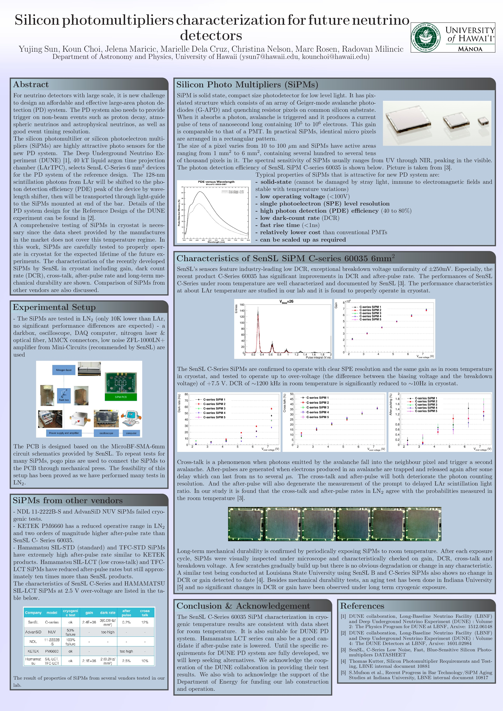

<h3 class="sectionHead">      
 Silicon photomultipliers characterization for future neutrino detectors 
 </h3>

Abstract 

   For neutrino detectors with large scale, it is a new challenge to design an affordable and effective large-are photon detection (PD) system. The PD system also needs to provide trigger on non-beam events such as proton decay, atmospheric neutrinos and astrophysical neutrinos, as well as good event timing resolution.  
   The silicon photomultiplier or silicon photoelectron multipliers (SiPMs) are highly attractive photo sensors for the new PD system. The Deep Underground Neutrino Experiment (DUNE) [1], 40 kT liquid argon time projection chamber (LArTPC), selects SensL C-Series 6 mm2 devices for the PD system of the reference design. The 128-nm scintillation photons from LAr will be shifted to the photon detection efficiency (PDE) peak of the device by wavelength shifter, then will be transported through light-guide to the SiPMs mounted at the end of the bar. Details of the PD system design for the Reference Design of the DUNE experiment can be found in [2]  
   A comprehensive testing of SiPMs in cryostat is necessary since the data sheet provided by the manufactures in the market does not cover this temperature regime. In this work, SiPMs are carefeully tested to properly operate in cryostat for the expected lifetime of the future experiments. The characterization of the recently developed SiPMs by SenSL in cryostat including gain, dark count rate (DCR), cross-talk, after-pulse and long-term mechanical durability are shown. Comparison of SiPMs from other vendors are also discussed. 
  

   

